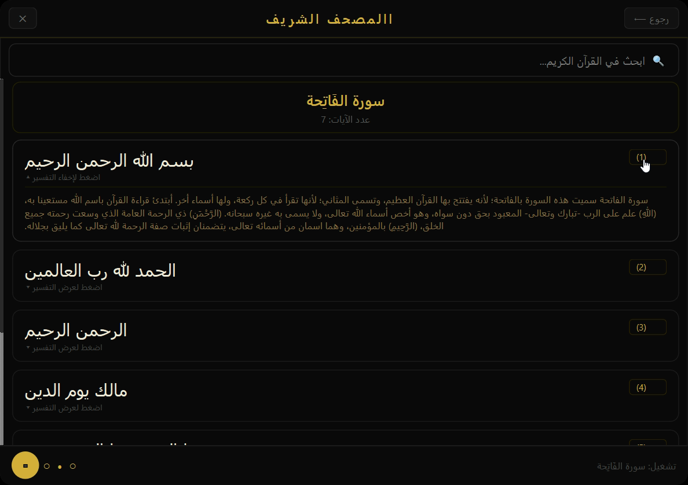
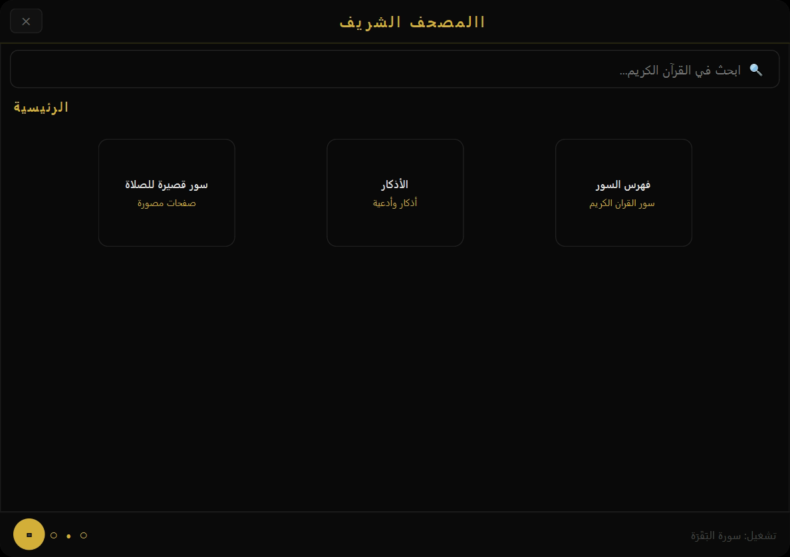
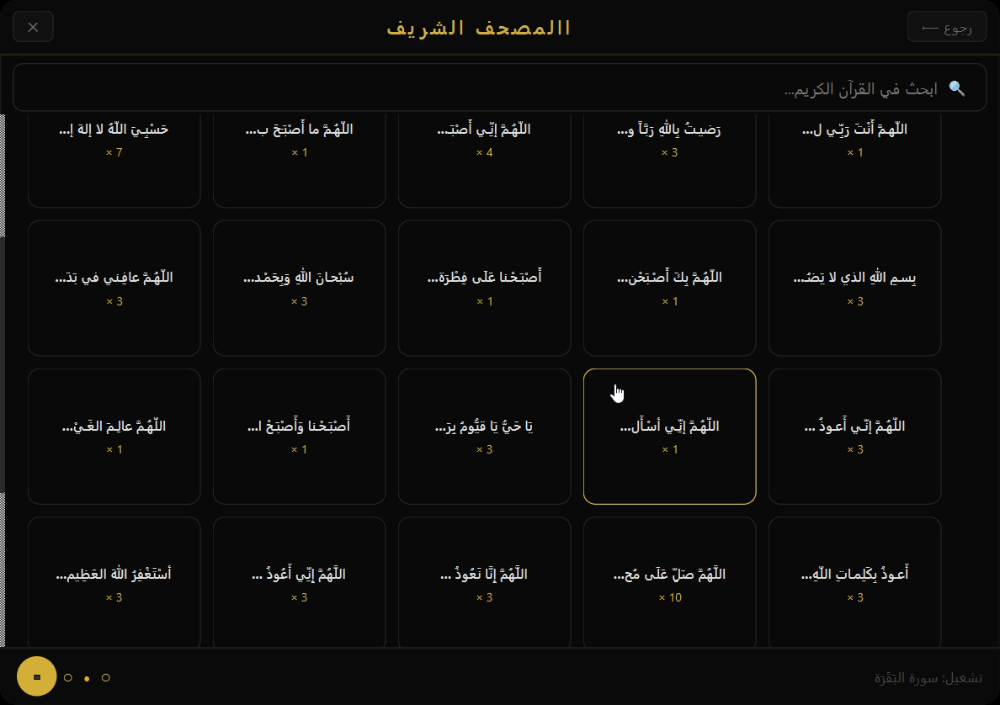
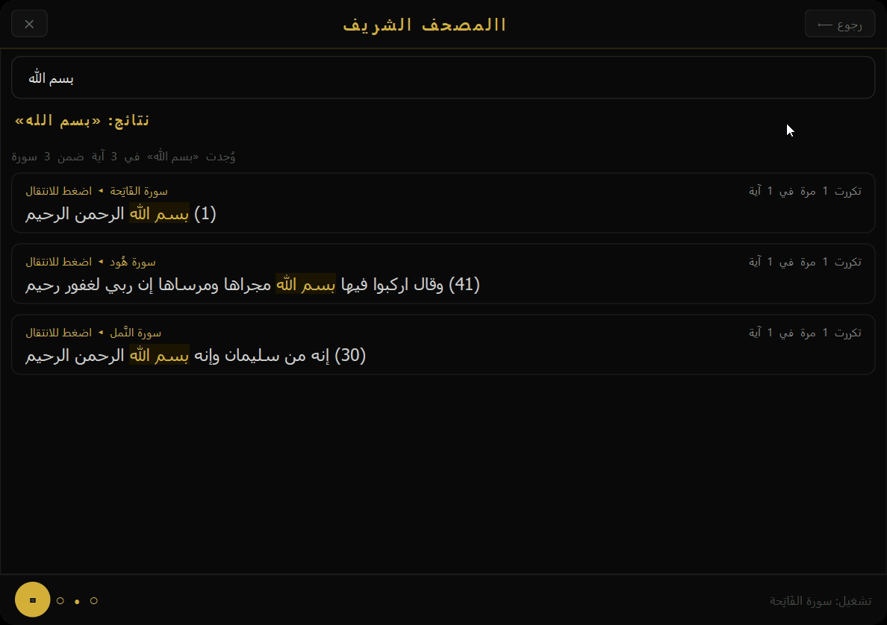

# القران الكريم - Holy Quran

## القران الكريم كامل يدون انترنيت - Full Holy Quran - Offline Version
## 📸 صور البرنامج - 📸 App Screenshots 

| Editor Interface | Screenshots |
| :---: | :---: |
|  |   |
|  |   |
|    |    |

## التحميل اضغط على الصورة - Click the icon below to Download 

---
© 2026 Yassir27 

 

